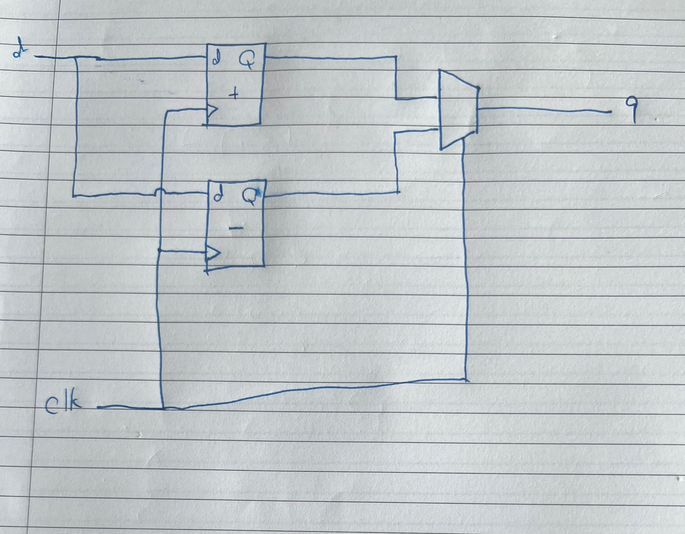

# Dualedge

**HDLBits link:** https://hdlbits.01xz.net/wiki/dualedge
**Category:** Circuits: Sequential (Latches and Flip-flops)
**Difficulty:** ⭐⭐⭐⭐

## Problem summary

Build a circuit that behaves like a single flip-flop triggered on *both* edges of `clk` — captures `d` on every rising **and** every falling edge. FPGAs have no such primitive, and `always @(posedge clk or negedge clk)` is explicitly illegal, so it has to be built out of ordinary single-edge flops plus combinational logic around them.

## Approach — two ways to build the same behaviour

Both solutions below start from the same two building blocks (a posedge flop and a negedge flop, both fed `d`) and differ only in how they combine those two captured values into one continuous `q`.

### `dualedge.v` — mux selected by `clk` itself

```verilog
always @ (posedge clk) t0 <= d;
always @ (negedge clk) t1 <= d;
assign q = clk ? t0 : t1;
```



The insight: right after a rising edge, `clk` is high *and* `t0` just captured the newest `d` — so selecting `t0` whenever `clk=1` always picks the freshest value. Symmetrically, right after a falling edge, `clk` is low and `t1` just captured `d`, so selecting `t1` whenever `clk=0` does the same thing on that side. `clk` isn't just the clock here — it's doing double duty as the mux select, and it happens to switch at exactly the moment the corresponding register becomes valid, because it's the same signal driving both.

### `alt1.v` — self-cancelling XOR pair, no mux

```verilog
always @ (posedge clk) p <= d ^ n;
always @ (negedge clk) n <= d ^ p;
assign q = p ^ n;
```

This one doesn't select between two values — it keeps `p` and `n` each holding "whatever value makes `p ^ n` equal to the last captured `d`," and lets the algebra do the work instead of a mux. Trace it through:

- **Just after a posedge:** `p` was just loaded with `d ^ n` (using `n`'s *old* value, from before this edge). So now `p ^ n = (d ^ n) ^ n = d`. The two `n`s cancel, leaving `d`.
- **Just after a negedge:** symmetrically, `n` loads `d ^ p` using `p`'s old value, so `p ^ n = p ^ (d ^ p) = d`.

Between edges, neither register changes, so `q = p ^ n` just holds. Each flop, on its own edge, loads a value specifically designed to cancel the *other* flop's contribution out of the XOR — that's the whole trick, and it's why the comment in the original code calls out "alternately load a value that will cancel out the other."

## Gotchas / things to watch for

- **The intuitive first idea — `always @(posedge clk, negedge clk)` — is not a workaround, it's flatly illegal, and the problem statement says so.** Every real FPGA flip-flop primitive is single-edge; there's no hardware for a sensitivity list with two opposite-polarity edges on the same signal, and no synthesis tool will accept it. This has to be built from single-edge flops plus glue logic — there's no clever syntax that sidesteps it, which is why the problem is rated as a circuit-design exercise rather than a coding one.
- **In the mux version, `clk` is both a clock and a select signal, and getting the mux inputs backwards is easy and silent.** `clk ? t0 : t1` depends on `t0` being the *posedge* flop's output and `t1` the *negedge* flop's — swap them (`clk ? t1 : t0`) and the mux selects the *stale* value at every edge instead of the fresh one, delaying `q` by a full half-cycle. It still compiles, still looks structurally right, and the bug only shows up once you check output timing against the expected waveform.
- **In the XOR version, the order of `p`'s and `n`'s definitions has to match which flop is which polarity, not just look symmetric.** `p <= d ^ n` must live in the `posedge` block and `n <= d ^ p` in the `negedge` block — swapping which expression goes in which block breaks the cancellation algebra (each flop would then be reinforcing its own next value instead of cancelling the other's), and the failure mode is a q that doesn't track d correctly rather than a compile error.
- **Neither circuit is a "real" dual-edge flip-flop, and the problem statement says this explicitly.** A genuine flip-flop's output is glitch-free; these are combinational logic (a mux, or an XOR) sitting downstream of two real flops, so in principle they can glitch briefly around an edge in a way a true dual-edge primitive wouldn't. HDLBits tells you to ignore this for the exercise, but it's worth knowing that "functionally equivalent for grading purposes" and "electrically identical" aren't the same claim — this is the reason genuine dual-edge circuits are rare in real designs even though the trick to build one is well known.
- **This pattern is worth recognizing as reusable, not just correct for this one problem.** Sampling on both edges of a slower/gated clock, or combining values from two differently-clocked registers via a mux keyed to the clock's current phase, is the same shape of idea behind DDR-style double-data-rate interfaces (real DDR memory literally captures data on both clock edges). The specific circuit here is a toy version of a genuinely industry-relevant pattern.

## Solution

See `dualedge.v` (mux selected by `clk`) and `alt1.v` (self-cancelling XOR pair).
